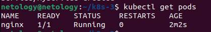

### Задание 1

[deployment.yaml](01%2Fdeployment.yaml)

[pod-multitool.yaml](01%2Fpod-multitool.yaml)

[svc-nginx-multitool.yaml](01%2Fsvc-nginx-multitool.yaml)

### Задание 2

[pod-nginx.yaml](02%2Fpod-nginx.yaml)

[myservice.yaml](02%2Fmyservice.yaml)

