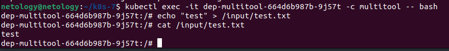

### Задание 1

[deployment.yaml](01%2Fdeployment.yaml)

[persistent-volume-claim.yaml](01%2Fpersistent-volume-claim.yaml)

[persistent-volume.yaml](01%2Fpersistent-volume.yaml)

Удалил Deployment и PVC. PV поменял статус с Bound на Released. До удаления PV был связан с PVC и Deployment, поэтому статус был Bound. А после удаления Deployment и PVC он уже ни с чем не связан, поэтому статус поменялся на Released.

Файл сохранился на локальном диске ноды.

Удалил PV, файл также сохранился на локальном диске ноды потому что значение в PV у persistentVolumeReclaimPolicy: Retain - это значит, что после удаления PV ресурсы из внешних провайдеров автоматически не удаляются.

### Задание 2

[deployment-multitool.yaml](02%2Fdeployment-multitool.yaml)

[pvc-nfs.yaml](02%2Fpvc-nfs.yaml)

